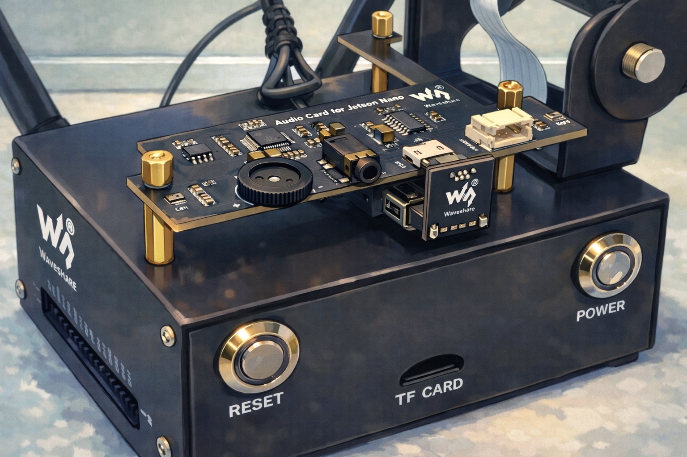

<div align="center">

# ChattyNano

### Back to [Maxwell](https://developer.nvidia.com/maxwell-compute-architecture)



</div>

Bringing **on-device** Speech Recognition (STT) and Text Generation (LLM) pipeline to an old [NVIDIA Jetson Nano](https://developer.nvidia.com/embedded/learn/get-started-jetson-nano-devkit) from 2019 with $${\color{purple}vibes}$$.

Might be the perfect project if you somehow forgot about owning a Jetson Nano board and want to make it busy doing stuff. **For fun only**, most of the technologies used are **deprecated**, **outdated** or **superseded** in one way or another. You've been warned.

**This project was heavily inspired by [whisper-edge](https://github.com/maxbbraun/whisper-edge)**

Verified on:
- Jetson Nano 4GB, rev A02
- Waveshare Audio Card for Jetson Nano
- [L4T 32.7.1](https://developer.nvidia.com/embedded/linux-tegra-r3271), [JetPack 4.6.1](https://developer.nvidia.com/embedded/jetpack-sdk-461)

# Fire that thang ✨

Your typical use-case is the following:
1. You ask stuff with the mic
2. STT transcribes stuff and passes the transcription to LLM
3. LLM responds

```bash
docker build -f Dockerfile -t chatty_nano:dev .
# for locally running LLM server
sudo bash run.sh --model-dir "path/to/coqui/tts/models" --openai-endpoint "http://localhost:8000/v1" --openai-model "tinyllama-1.1b-chat" --openai-api-key "123"
# or:
sudo bash run.sh --help
```

```console
<...>
Using input device: plughw:CARD=Device,DEV=0
Default input config: SupportedStreamConfig { channels: 2, sample_rate: SampleRate(44100), buffer_size: Range { min: 2, max: 4294967294 }, sample_format: F32 }
Recording complete. Transcribing...

Transcription:
hello there what is the meaning of life

Transcription time: 3.492165433s

Sending transcription to AI server...

AI Response:
The meaning of life is an enduring and complex question that has fascinated humans for centuries. It can be interpreted as a philosophical, spiritual or religious inquiry that seeks to find deeper meanings in human existence. There are no definitive answers, but there are many perspectives and opinions on what the meaning of life may entail.
<...>
```

The following arguments are accepted for configuration:

```bash
Speech-to-Text application using Coqui STT

Usage: jetson-stt [OPTIONS] --model-dir <MODEL_DIR>

Options:
  -m, --model-dir <MODEL_DIR>
          Model directory containing the model files
      --chunk-seconds <CHUNK_SECONDS>
          The length in seconds to wait for audio recording to transcribe [default: 10]
      --input-device <INPUT_DEVICE>
          The input device used to record audio [default: plughw:CARD=Device,DEV=0]
      --num-channels <NUM_CHANNELS>
          The number of channels of the recorded audio [default: 1]
      --sample-rate <SAMPLE_RATE>
          The sample rate of the recorded audio [default: 16000]
      --openai-endpoint <OPENAI_ENDPOINT>
          OpenAI API endpoint (default: https://api.openai.com/v1) [default: https://api.openai.com/v1]
      --openai-model <OPENAI_MODEL>
          OpenAI model name (e.g., gpt-4, gpt-3.5-turbo) [default: gpt-3.5-turbo]
      --openai-api-key <OPENAI_API_KEY>
          OpenAI API key (optional, can be set via OPENAI_API_KEY env var)
  -h, --help
          Print help
  -V, --version
          Print version
```

## STT
Coqui STT running on CPU is used.
_You can consider this a tribute to the great work and reflect a little on how far things have come in just 6 years._
  
Download the STT models you're interested in from [here](https://github.com/coqui-ai/STT-models/releases), `*.tflite` and `*.scorer`, put them in `data/models`

The credit goes to:
- [**`coqui-ai/STT`**](https://github.com/coqui-ai/STT)
- [**`tazz4843/coqui-stt`**](https://github.com/tazz4843/coqui-stt)
- [**`domcross/DeepSpeech-for-Jetson-Nano`**](https://github.com/domcross/DeepSpeech-for-Jetson-Nano)

## LLM
You can specify any OpenAI compatible endpoint, but to make everything run on device here's what you need to do:

> [!IMPORTANT]
Power supply might be a bottleneck, if the board goes down the easiest way is to switch to 5W mode by `sudo nvpmodel -n 1`

```bash
docker run -it \
    -p 8000:8000 \
    acerbetti/l4t-jetpack-llama-cpp-python:latest \
    /bin/bash -c \
    'python3 -m llama_cpp.server \
        --model $(huggingface-downloader TheBloke/TinyLlama-1.1B-Chat-v1.0-GGUF/tinyllama-1.1b-chat-v1.0.Q5_K_M.gguf) \
        --model_alias tinyllama-1.1b-chat \
        --n_ctx 1024 \
        --n_gpu_layers 35 \
        --host 0.0.0.0 \
        --port 8000'
```

The above will start an outdated version of `llama.cpp` OpenAI compatible server running on `8000`, accelerated by Tegra X1 available on the board. `tinyllama-1.1b-chat` will be something around 5TPS.
**All the credit goes to [Running llama.cpp on the Jetson Nano](https://www.caplaz.com/jetson-nano-running-llama-cpp/)**

### Future ideas
* [ ] Bring [TTS](https://github.com/coqui-ai/TTS)
* [ ] Attach [HomeAssistant MCP](https://www.home-assistant.io/integrations/mcp_server/) to LLM and smart-home enable the board
* [ ] Try bringing [YoloE](https://docs.ultralytics.com/models/yoloe/) and via STT promptable segmentation

### Setup on the photo
- Jetson Nano 4GB, rev A02
- [Waveshare Jetson Nano Case](https://www.waveshare.com/wiki/Jetson_Nano_Case_(C))
- [Waveshare Audio Card for Jetson Nano](https://www.waveshare.com/wiki/Audio_Card_for_Jetson_Nano)
- And edit reference pic of the setup with the prompt of `Make it Ghibli style, keep the macro and overall aesthetics` :rage1:
